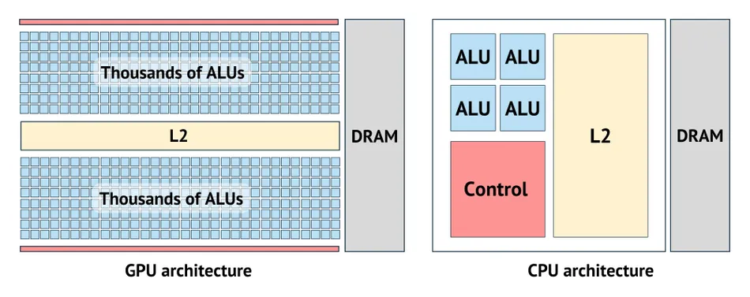
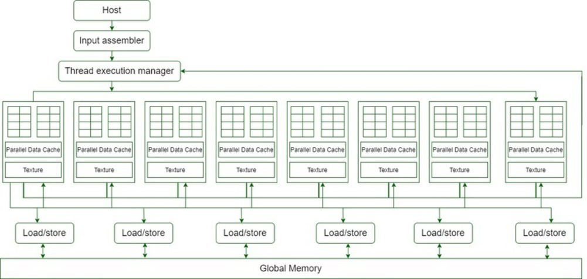
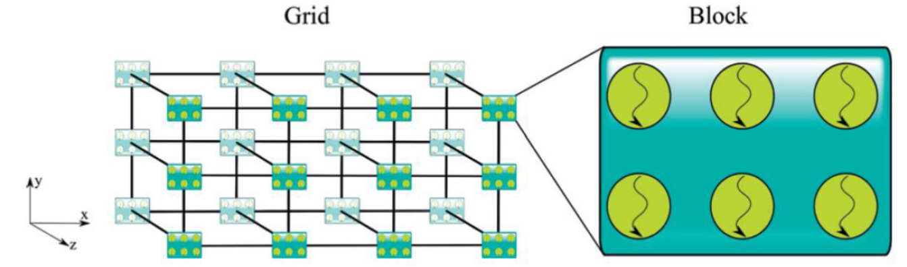
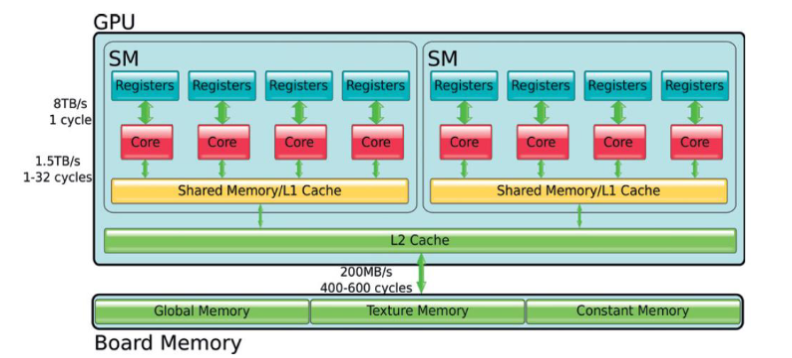
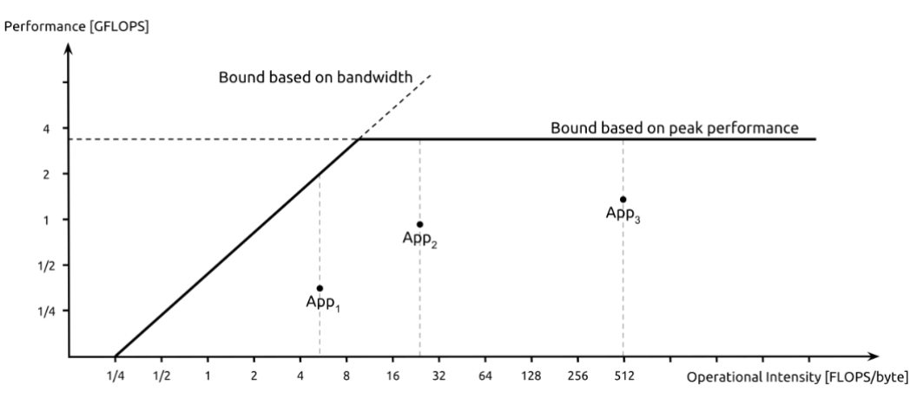
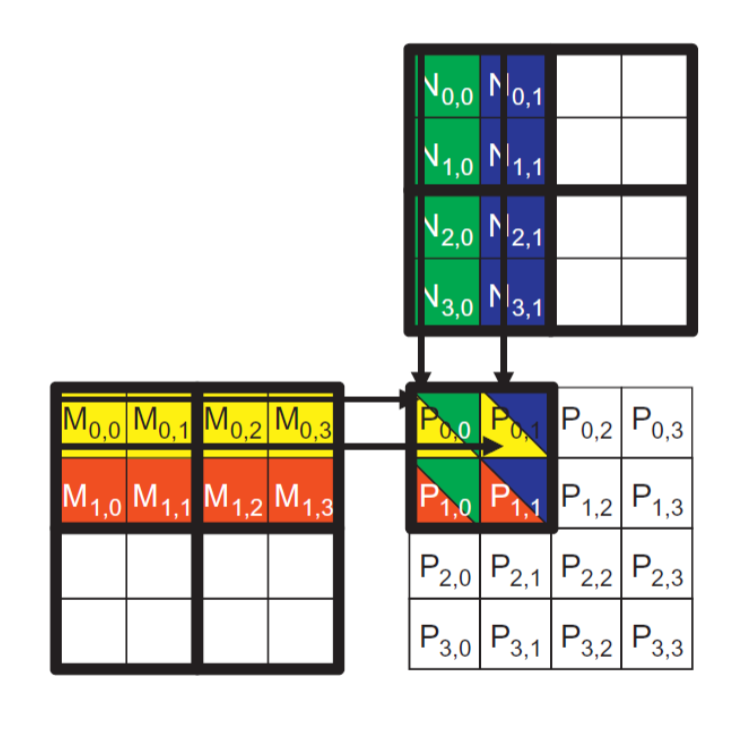

## CPU

Architettura specifica per eseguire codice in sequenziale per metterci meno tempo possibile.

### Suddiviso in:

- **Cache**: Convert long latency memory accesses to short latency cache accesses
- **DRAM**
- **Unità di controllo**
- **Unità di calcolo ALU**

## GPU

Architettura specifica per eseguire codice in parallelo, inizialmente incentrato sul rendering di immagini. Throughput più elevato possibile

### Suddiviso in:

- **90% del chip dedicato a unità di calcolo**: meno potente della CPU, frequenza più alta ma è possibile inserirne di più
- **Unità di controllo divise in più core**: No branch prediction, In-order execution
- **Small caches**: To boost memory throughput
- **DRAM**: banda più alta, più thread possono accedere alla memoria in parallelo



## Connessioni tra CPU e GPU

### Connessioni più utilizzata è PCIe bus:

Con **1 linea** per CPU, GPU, RAM.
```
             RAM
              |
CPU - PCIe - GPU - DRAM
```

## Problemi nella Gestione della Memoria

- La GPU e l'host non condividono la stessa memoria, rendendo necessario un costante trasferimento.
- Le GPU potrebbero non seguire la stessa rappresentazione dei numeri a virgola mobile e avere la stessa accuratezza delle CPU.

## CUDA-core

- Più core raggruppati in **Streaming Multiprocessor (SM)** (NVIDIA), condividono la stessa cache e la stessa unità di controllo.
- 2+ formano **building block** (NVIDIA).
- Memoria globale condivisa tra tutti SM.
- Architettura che permette l'esecuzione di molti thread in parallelo.




### Thread Organizzati in una Struttura 6D:

- **Insieme di cubi detta griglia**
- **Ogni vertice** ha un blocco con tot thread
- È possibile ottenere le **coordinate di ogni thread**
- Ogni GPU ha una capacità computazionale che indica le dimensioni massime di blocchi e griglia
- Le dimensioni si possono assegnare mediante **dim3** vettore di interi:

    ```cpp
    dim3 block(3,2); // rettangolo 3x2
    dim3 grid(4,3,2); // parallelepipedo 4x3x2
    foo<<<grid, block>>>();
    ```

    Quindi una griglia con 24 blocchi ognuno con 6 thread.



## Struttura di un Programma CUDA

1. **Allocazione memoria GPU**
2. **Trasferimento dati da memoria host → GPU**
3. **Esecuzione del kernel CUDA**
4. **Trasferimento risultati da memoria GPU → host**

## Thread Scheduling

- Ogni thread viene eseguito su un processore di streaming (CUDA core).
- I core sullo stesso SM condividono l'unità di controllo, cioè devono eseguire sincronicamente la stessa istruzione.
- SM diversi possono eseguire kernel differenti.
- Ogni blocco viene eseguito su un SM, quindi non posso avere un blocco che si estende su più SM, ma posso avere più blocchi che vengono eseguiti sullo stesso SM.
- Una volta che un blocco è completamente eseguito, l'SM eseguirà il successivo.
- Non tutti i thread in un gruppo vengono eseguiti contemporaneamente.

## Warps

- Vengono eseguiti in gruppi chiamati **warps**, dimensione di default 32.
- I thread in un blocco sono divisi in warps secondo il loro ID intra-blocco (cioè, i primi 32 thread in un blocco appartengono allo stesso warp, i successivi 32 thread a un warp diverso, ecc...)
- **Single Instruction, Multiple Data (SIMD)**: Allo stesso tempo tutti i thread nel warp eseguono la stessa istruzione, stesso timing di esecuzione.
- Più warp possono essere eseguiti parallelamente.

## Divergenza dei Warps

- Tutti i thread in un warp avranno sempre lo stesso timing di esecuzione.
- **Cosa succede se un'operazione condizionale (if else) porta i thread su percorsi diversi?**
    - Tutti i thread coinvolti nell'if vengono eseguiti e vengono messi in stallo tutti gli altri.
    - Quando finiscono i thread coinvolti nell'else, vengono eseguiti e vengono messi in stallo tutti gli altri.
    - Avanti così finché il codice non torna univoco.


## Tipi di Memoria nella GPU


- **Registers**: Molto veloci, usati per le variabili locali dei thread, una per ogni core dell'SM. Se finiscono le variabili, vengono inserite nella memoria globale; il compilatore decide dove allocare le variabili.
- **Memoria condivisa**: Condivisa tra i thread di uno stesso blocco, veloce e può essere usata per la comunicazione tra i thread.
    - Può essere utilizzata come:
        - Dati utilizzati frequentemente
- **Lo specificatore `__shared__`** può essere utilizzato per indicare che alcuni dati devono andare nella memoria condivisa on-chip piuttosto che nella memoria globale.
- **Memoria condivisa vs. Cache L1**:
    - Entrambe sono on-chip. La prima è gestita dal programmatore, la seconda automaticamente.
    - Non hai alcuna garanzia che i dati di cui hai bisogno saranno nella cache L1, ma con la memoria condivisa gestita esplicitamente, puoi controllarlo.
- **L1/L2 Cache**: Usata per la lettura di dati tra gli SM e la memoria globale.
- **Global Memory**: Lenta e non condivisa tra i vari SM, unica accessibile tramite funzioni CUDA.
- **Texture Memory**: Veloce e può essere usata per la lettura di dati.
- **Constant Memory**: Veloce e può solo immagazzinare variabili costanti.
    - **Cached**
    - **Supporta il broadcasting a tutti i thread nel warp**

    Ponendo di avere più warp i quali devono accedere alla stessa variabile:

    1. **Se su memoria globale:**
        - Il primo la invia alla L2, gli altri warp potrebbero non trovarla in L2 e andare a cercarla in globale, questo perché potrebbero accedervi troppo in ritardo e intanto il primo warp ha cacheato altri valori.

    2. **Se su memoria costante:**
        - Il primo warp la copia nella memoria cache-costante, poiché vengono scritti dati con poca frequenza è più probabile che venga trovata dagli altri warp.

    Come allocare in memoria costante:

    ```cpp
    __constant__ type variable_name; // static
    cudaMemcpyToSymbol(variable_name, &host_src, sizeof(type), cudaMemcpyHostToDevice);
    ```

    Tutti i thread possono accedervi e rimane finché non finisce il programma.

## Per Info su Utilizzo Memoria

```bash
$ nvcc -Xptxas -v file.cu
```

## Prestazioni GPU

Calcolate mediante il numero di operazioni in virgola mobile al secondo (FLOP/s), il valore va scalato in base al numero di bit.

Ponendo di avere la memoria globale a 200 GB/s e una GPU con 1500 GFLOP/s, possiamo caricare:

```
(200 GB/s) / (4 bytes) = 50 milioni di operandi/s
```

Caricando un'operazione per operando, abbiamo una performance di 50 GFLOP/s, che è il 3.3% (50/1500) della capacità totale. La memoria limita le prestazioni (memory bound) ed è necessario diminuire gli accessi alla memoria globale.

#### Rapporto tra calcolo e accesso alla memoria globale

Il compute-to-global-memory-access ratio è il numero di operazioni eseguite per ogni accesso alla memoria globale.

#### Intensità aritmetica/operativa

Operazioni per byte.

Per raggiungere il picco di prestazioni del processore, che è di 1.5 teraflop al secondo (1.5 TFLOP/s), è necessario un rapporto di 30 o superiore. Questo significa che per ogni operando caricato, devono essere eseguite 30 operazioni in virgola mobile. È quindi necessario aumentare il numero di operazioni in virgola mobile per ogni accesso alla memoria. L'avanzamento tecnologico non è favorevole poiché tende principalmente all'aumento della capacità di calcolo invece che all'aumento della bandwidth delle memorie.


## Roofline Model



La linea orizzontale rappresenta il picco delle prestazioni della GPU, mentre la linea obliqua indica il picco di prestazioni limitate dalla bandwidth.

Esempio:
- Con un'intensità di operazioni FLOP/Byte = 6, si può raggiungere un picco di prestazioni di 2 GFLOP/s.
- Per raggiungere il picco massimo delle prestazioni della GPU è necessaria un'intensità di 12+ FLOP/Byte.

- App1 è limitata dalla banda di memoria.
- App2 e App3 sono limitate dalle prestazioni.
- Tutte sono ottimizzate in modo errato poiché nessuna raggiunge il picco massimo.

È possibile aumentare le prestazioni provando:
1. Aumentare l'intensità di operazioni.
2. Dati immagazzinati nella shared memory > global > DRAM.

## Tiling



Nota però che il valore dovrebbe essre utilizzato subito e per matrici grandi potrebbe presentarsi il problema del dato rimosso dopo tanto tempo di esecuzione


Partiziono matrici input in "mattonelle" "Tiles" 

### Prima fase:
- Parto dalla prima mattonella di entrambe le matrici.
- Ogni thread caricherà il valore di entrambe le mattonelle le cui coordinate coincidono con quelle del thread. Quindi P(0,0) caricherà i due valori in posizione (0,0).
- Tutti i thread sono sincronizzati e non calcolano finchè tutti non hanno caricato.

### Fase 2:
Seconda mattonella di entrambe le matrici. Esecuzione uguale a prima.